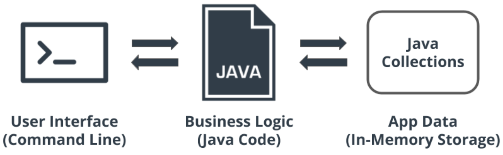

# Hotel-Reservation-Application

The hotel reservation application will allow customers to find and book a hotel room based on room availability. 
This project will demonstrate your abilities to design classes using OOP, organize and process data with collections, and use common Java types.

## Main Components of the App
The major components of the Hotel Reservation Application will consist of the following:

* **CLI for the User Interface**. We'll use the Command Line Interface (or CLI for the user interface. For this, we'll need to have Java monitor the CLI for user input, so the user can enter commands to search for available rooms, book rooms, and so on.
* **Java code**. The second main component is the Java code itself—this is where we add our business logic for the app.
* **Java collections**. Finally, we'll use Java collections for in-memory storage of the data we need for the app, such as the users' names, room availability, and so on.

## User Scenarios

The application provides four user scenarios:

* Creating a customer account. The user needs to first create a customer account before they can create a reservation.

* Searching for rooms. The app should allow the user to search for available rooms based on provided checkin and checkout dates. If the application has available rooms for the specified date range, a list of the corresponding rooms will be displayed to the user for choosing.

* Booking a room. Once the user has chosen a room, the app will allow them to book the room and create a reservation.

* Viewing reservations. After booking a room, the app allows customers to view a list of all their reservations.

## Admin Scenarios

The application provides four administrative scenarios:

* Displaying all customers accounts.
* Viewing all of the rooms in the hotel.
* Viewing all of the hotel reservations.
* Adding a room to the hotel application.
